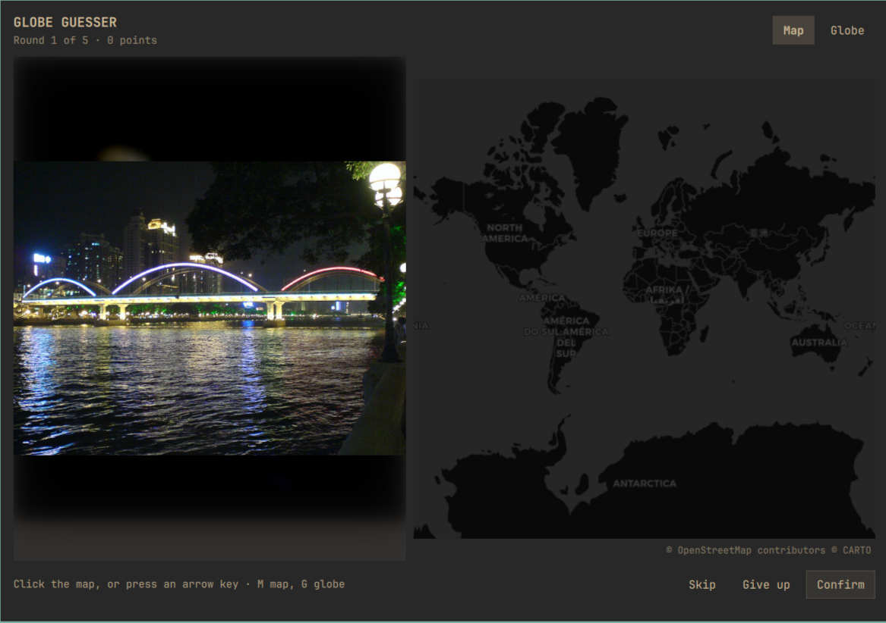

# Globe Guesser



A photograph, somewhere on Earth. Click the map — or spin the globe — to say
where you think it was taken.

Five rounds, 5,000 points each, scored on how close you got. Your best run is
kept.

## What it does

- **A real photo of a real place.** Each round draws a city from a bundled list
  of the 1,000 largest in the world, then asks Wikipedia which *articles* sit
  near it and takes their lead images. An article with a coordinate is almost by
  definition a place — a station, a bridge, a district, a cathedral — and its
  lead image is a photograph an editor chose to show what that place looks like.
  The answer is the article's own recorded position, not the city centre.
- **Two ways to guess.** An OpenStreetMap map you can zoom down to street level,
  or a globe you can spin. The map draws OpenStreetMap tiles; the globe, and the
  map when there is no network, are drawn from bundled Natural Earth outlines —
  so the game stays playable offline, it simply loses the detail.
- **Playable without a mouse.** Arrow keys (or `hjkl`) place and nudge the pin,
  `Enter` confirms, `M` and `G` switch between map and globe, `Esc` closes.
- **Attribution shown.** Commons photographs are almost all CC-licensed. The
  photographer and the licence appear with the answer, because the licence is
  only honoured if they travel with the picture.

## Use

| Control | What it does |
|---|---|
| Click the map or globe | Place your guess |
| Drag | Pan the map, or spin the globe |
| Scroll | Zoom, centred on the pointer — the map goes all the way to street level |
| Arrow keys / `hjkl` | Place the pin, then nudge it — finer the further you are zoomed in |
| `M` / `G` | Switch to the map / the globe |
| `Enter` | Confirm the guess, then move to the next round |
| `Esc` | Close the panel — a game in progress is still there when you reopen it |
| Skip | Draw a different photo without scoring the round |

## Install

```sh
omarchy plugin add https://github.com/kairos-tech-oh/omarchy-globe-guesser.git --enable
```

Then add **Globe Guesser** to your bar from the Omarchy settings UI, under *Fun*.

The shell normally picks the plugin up immediately. If the widget does not
appear, restart it once:

```sh
omarchy restart shell
```

## Update

```sh
omarchy plugin update kairos.globe-guesser --yes
```

## Remove

```sh
omarchy plugin remove kairos.globe-guesser --yes
```

If the plugin directory was placed at `~/.config/omarchy/plugins/kairos.globe-guesser`
by hand rather than by `omarchy plugin add`, remove that directory and restart
the shell instead:

```sh
rm -rf ~/.config/omarchy/plugins/kairos.globe-guesser
omarchy restart shell
```

**State left behind.** Two things, and `omarchy plugin remove` deletes neither,
so remove them by hand if you want nothing left:

```sh
rm -f  ~/.local/state/omarchy/globe-guesser-state.json   # best score, games played
rm -rf "${XDG_RUNTIME_DIR:-/run/user/$(id -u)}/omarchy-globe-guesser"
rm -rf ~/.cache/omarchy-globe-guesser                     # only if XDG_RUNTIME_DIR was unavailable
```

The first is a 34-byte JSON file holding your best score and how many games you
have finished. The second is the photo cache: at most two JPEGs at a time, in a
directory that is cleared at logout anyway because it lives on tmpfs. Your
chosen settings live in the shell's own `shell.json` alongside every other
widget's, and are removed with the widget when you delete it from your bar.

## Settings

Under *Fun* in the Omarchy settings UI.

| Setting | Options | Default | What it changes |
|---|---|---|---|
| Difficulty | easy / normal / hard | normal | Which cities a round can come from: the 150 largest, the 500 largest, or all 1,000 |
| Rounds per game | 3–10 | 5 | How many photos make up one game |
| Starting view | map / globe | map | Which surface a round opens on. You can switch mid-round either way |
| Photo radius (km) | 1–10 | 10 | How far from a city centre a place may be. 10 km is both the default and MediaWiki's hard ceiling for a geosearch, so this only ever narrows the search |

## Network use

Three small requests per round, all anonymous, none needing an API key or an
account.

| Service | What for | Published limit | What this plugin does |
|---|---|---|---|
| `en.wikipedia.org/w/api.php` | One `geosearch` query listing articles near a city with their coordinates and lead images | No hard anonymous limit; the [user-agent policy](https://foundation.wikimedia.org/wiki/Policy:User-Agent_policy) requires a descriptive User-Agent | One identifying User-Agent, one query per round, never more than one request per second. Measured 17–30 KB per reply |
| `upload.wikimedia.org` | Downloads the one chosen photograph | — | One download per round, capped at 6 MB, no redirects followed |
| `commons.wikimedia.org/w/api.php` | The photographer and licence for that one file, so the credit can be shown | as above | One request per round, at reveal, off the path that decides how fast the photo appears. Measured 361 bytes |
| `basemaps.cartocdn.com` | OpenStreetMap map tiles, while the map is on screen | Free public basemaps, attribution required | At most 64 tiles at a time, ~18 for a typical pane, six transfers in flight. Each capped at 256 KiB and refused unless it is a PNG of at most 512×512. Cached on disk and by URL, so panning back over ground already seen costs nothing |

**Why CARTO and not `tile.openstreetmap.org`.** The OSM Foundation's
[tile usage policy](https://operations.osmfoundation.org/policies/tiles/) forbids
distributing an application that draws on their servers — they are donated
infrastructure for the map's own website, not a free CDN. CARTO renders the same
OpenStreetMap data and publishes these basemaps for public use with attribution,
which the map shows.

Every response is capped at the producer before the shell can hold it: 256 KiB
for the article query, 32 KiB for the credit, 6 MB for the photograph. Nothing
else is contacted, ever. The map, the globe, the scoring and the "12 km from
Kyoto" line are all computed from bundled data.

**Nothing is loaded into an `Image` straight off the network** — not the
photographs, and, since the decode ceiling was tightened, not the map tiles
either. Both are downloaded first, under a byte ceiling at the producer, and both
have their image header read and checked before anything decodes them.

The reason the header check exists and a size cap is not enough: a PNG stores its
pixel count in the header and its pixels compressed, so the two numbers are
unrelated. A 61 KiB file can declare 8000×8000. Qt's `sourceSize` does not save
you there — it scales *during* load for JPEG only, and for any other format it
loads the source at full size and scales afterwards, so the peak is already paid.
Measured on Qt 6.11.1, loading such a file into an `Image` with `sourceSize` set
to 320×240 peaked at **439.6 MiB** against a 75.2 MiB baseline, inside the
long-lived shell process. So a photograph is refused above 8 megapixels and a
tile above 512×512, on the dimensions their headers declare, before a decoder
ever sees the bytes.

One extra request happens when you **open** the panel while no game is running:
the first round is fetched while you are still looking at the start screen, so
pressing Start shows a photograph rather than a spinner. Opening the game is
taken as intending to play; merely having the widget on your bar is not, and
nothing is fetched at login.

Turn the network off mid-game and the photograph fails with a readable message
and a **Try another** button. The map notices its tiles are not arriving and
falls back to the bundled outlines, so you can still place a guess — with
country shapes instead of streets.

## Where the map comes from

The detailed map is OpenStreetMap data, rendered by CARTO, fetched as tiles while
you play. The fallback map and the globe come from bundled data:

`data/WorldOutline.js` and `data/Places.js` are generated from
[Natural Earth](https://www.naturalearthdata.com/) (public domain), pinned to an
exact upstream commit. `data/PROVENANCE.md` records the commit, the SHA-256 of
every input and output, and how to reproduce them:

```sh
tools/build-world.py --check
```

## Development

```sh
tools/run-checks.sh
```

Runs three things: that both data files rebuild byte-for-byte from the pinned
upstream commit, that the maths and the sanitisers behave under Node, and that
they behave under Qt's V4 engine — which is the engine omarchy-shell actually
uses, and is not Node.

### Files

| File | What it is |
|---|---|
| `BarWidget.qml` | The bar slot and the click target that opens the panel |
| `Panel.qml` | The game: state machine, the two network calls, scoring, persistence |
| `GlobeMap.qml` | The guessing surface — tiles, outline canvas, markers, pan/zoom/spin |
| `TileLayer.qml` | The OpenStreetMap tile grid — fetching tiles under a byte and dimension ceiling, caching them, and noticing when they cannot be reached |
| `PhotoPane.qml` | The photograph, its loading and error states, and its attribution |
| `GeoMath.js` | Projections and their inverses, great-circle distance, the score curve |
| `Sanitise.js` | Everything that crosses into or out of the plugin as text |
| `data/` | Generated country outlines and city list, with provenance |
| `tools/` | The generator and the check suite |

## Dependencies

`curl`, `head`, `od`, `mktemp`, `timeout`, `find` — all present on any Omarchy
install. `python3` and `node` are needed only to regenerate the data or run the
checks, never to play.

## Attribution

Photographs are the lead images of [Wikipedia](https://en.wikipedia.org/)
articles, served by [Wikimedia Commons](https://commons.wikimedia.org/), and
remain under their own licences, shown with each answer.

Map tiles are © [OpenStreetMap](https://www.openstreetmap.org/copyright)
contributors, © [CARTO](https://carto.com/attributions), shown on the map itself.
OpenStreetMap data is licensed under the
[ODbL](https://opendatacommons.org/licenses/odbl/).

The bundled fallback map and the city list are from
[Natural Earth](https://www.naturalearthdata.com/), public domain.

## Licence

MIT. See `LICENSE`.
